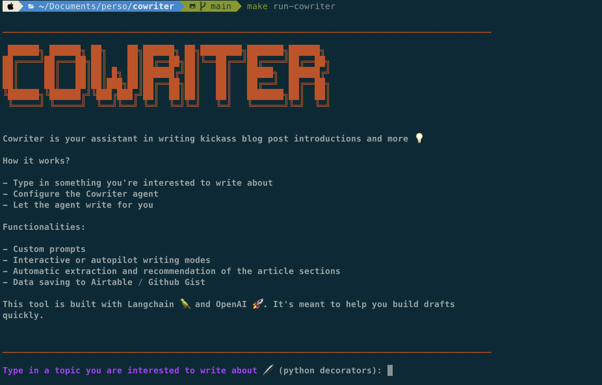

# Cowriter

Cowriter helps you automatically or semi-automatically write technical blog posts.

It first asks you about a topic of interest, then guides you through the process of writing the introduction as well as the subsequent sections.

It can also go wild in autopilot mode (use this responsibly)

<p align="center">
    
</p>


### Tools and libraries used

* **Langchain** 🦜 to build and compose LLMs
* **Rich** to build a cool terminal UX/UI
* **Poetry** to manage dependencies

### Third party services
* OpenAI (🔑 needed)

### Run the app locally

* Install dependencies with poetry

```bash
poetry install --with dev
```

* Add API credentials

Create .env file at the root of the project with the following keys:

```bash
OPENAI_API_KEY=<OPENAI KEY>
```

More info on these credentials [here](https://openai.com/)

* Run the app

```bash
make run-cowriter
```
